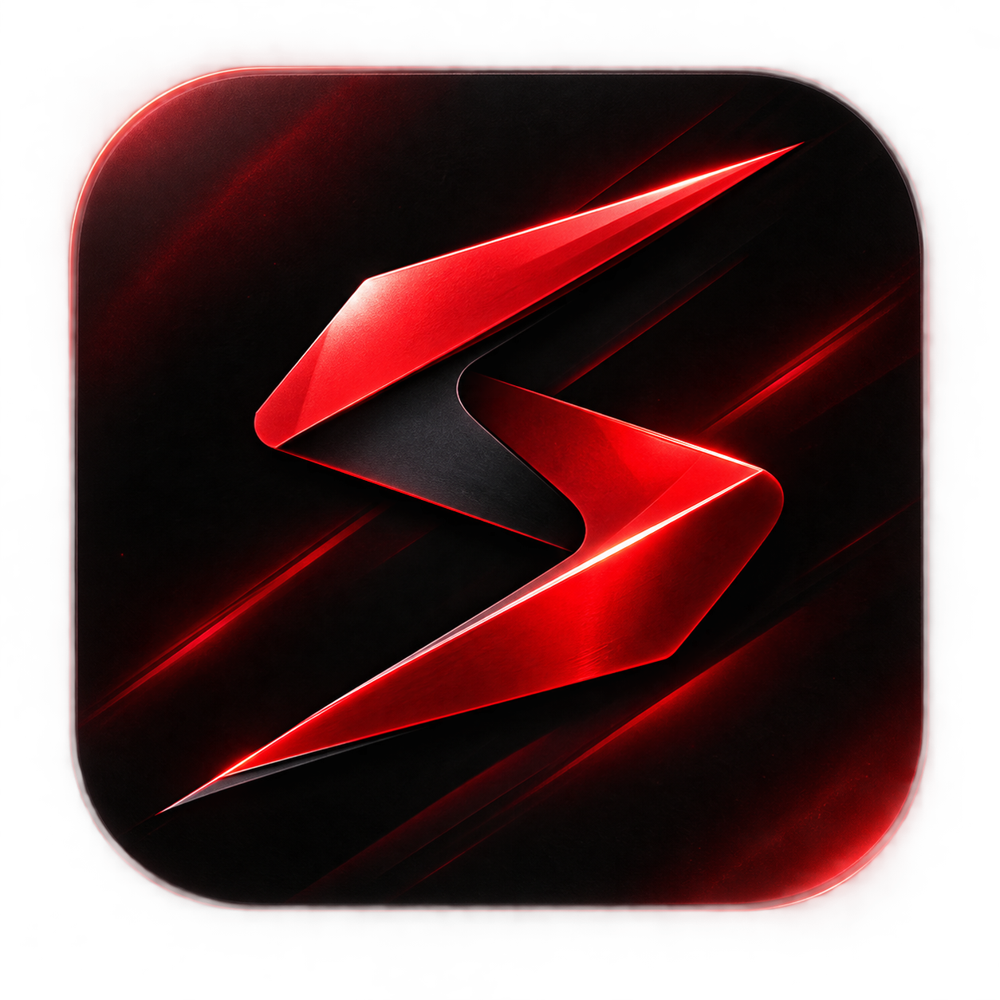

<div align="center">
  
  
  
  # SkyCuts Studio
  
  **Elite Video Review & Delivery Platform**

  [](https://reactjs.org/)
  [](https://nodejs.org/)
  [](https://www.mongodb.com/)
  [](https://vitejs.dev/)
  [](https://socket.io/)

  *A premium project management and delivery ecosystem designed exclusively for professional video editors, colorists, and post-production studios.*

</div>

---

## 📖 Table of Contents
- [About the Project](#-about-the-project)
- [Key Features](#-key-features)
- [Architecture & Tech Stack](#-architecture--tech-stack)
- [Project Structure](#-project-structure)
- [Getting Started](#-getting-started)
  - [Prerequisites](#prerequisites)
  - [Environment Variables](#environment-variables)
  - [Installation & Running](#installation--running)
- [License](#-license)

---

## 🎯 About the Project

**SkyCuts** bridges the gap between creative post-production work and seamless client management. It replaces fragmented workflows (emails, unlisted YouTube links, messy invoices) with a single, elegant platform. Clients can submit project briefs, review watermarked dailies, chat in real-time, pay invoices securely, and download final high-res HLS transcoded files—all within a stunning, glassmorphism-inspired UI.

---

## ✨ Key Features

### 🏢 Client Portal (`/client`)
- **Frictionless Onboarding:** Secure Google OAuth sign-in.
- **Dynamic Portfolio:** View the editor's public showreel and past works.
- **Project Requests:** Submit structured project briefs with technical requirements, deadlines, and references.
- **Real-Time Collaboration:** Project-scoped workspaces featuring live chat via Socket.io.
- **Secure Payments:** Integrated Razorpay checkout supporting INR and standard credit/debit networks.
- **Asset Delivery:** Built-in video player for reviewing edits, and secure download links for finalized, high-quality deliverables.

### 🎛️ Admin Studio (`/admin`)
- **Centralized Dashboard:** Manage all incoming project requests and track their status (Awaiting Assets, In Progress, Review, Paid, Delivered).
- **Client Management:** Overview of all registered clients and their respective projects.
- **Media Engine:** Automated uploading, processing, and HLS transcoding powered by Cloudinary.
- **Revenue Tracking:** Monitor paid projects and pending invoices.

---

## 🛠 Architecture & Tech Stack

The application is built on the **MERN** stack, supercharged with modern tooling for performance and real-time capabilities.

### Frontend
- **Framework:** React 18 powered by Vite for lightning-fast HMR.
- **Styling:** Custom Vanilla CSS with modern aesthetics (Glassmorphism, CSS Variables, fluid typography).
- **Animations:** Framer Motion for buttery-smooth page transitions and micro-interactions.
- **Routing:** React Router v6.
- **State & Auth:** React Context API + Google Identity Services (`@react-oauth/google`).

### Backend
- **Core:** Node.js & Express.js.
- **Database:** MongoDB with Mongoose ODM.
- **Real-Time:** Socket.io for bi-directional chat and live project updates.
- **Security:** JWT authentication, bcrypt password hashing, and strict CORS policies.
- **Integrations:** Razorpay (Payments), Cloudinary (Video hosting/transcoding).

---

## 📁 Project Structure

This repository is structured as a monorepo containing three distinct services:

```text
skycuts/
├── admin/               # React SPA for the Editor/Admin
│   ├── src/             
│   └── vite.config.js   
├── client/              # React SPA for Clients/Public
│   ├── src/             
│   └── vite.config.js   
└── server/              # Node.js Express REST API & Socket server
    ├── controllers/     
    ├── models/          
    ├── routes/          
    └── index.js         
```

---

## 🚀 Getting Started

Follow these instructions to get a copy of the project up and running on your local machine.

### Prerequisites
Before you begin, ensure you have the following installed and configured:
- **Node.js** (v18.0.0 or higher)
- **MongoDB** (Local instance or MongoDB Atlas cluster)
- **Razorpay Account** (Test keys)
- **Cloudinary Account** (Cloud Name, API Key, API Secret)
- **Google Cloud Console** (OAuth Web Client ID)

### Environment Variables
You will need to create `.env` files in all three directories (`client`, `admin`, and `server`) with your specific API keys and secrets. Contact the repository owner for the template if you are an authorized contributor.

### Installation & Running

Open your terminal and run the following commands to install dependencies and start the development servers. It is recommended to use three separate terminal tabs.

**Terminal 1: Backend Server**
```bash
cd server
npm install
npm run dev
```
*(Server will start on http://localhost:5001)*

**Terminal 2: Client App**
```bash
cd client
npm install
npm run dev
```
*(Client will start on http://localhost:5175)*

**Terminal 3: Admin App**
```bash
cd admin
npm install
npm run dev
```
*(Admin will start on http://localhost:5176)*

---

## 📄 License

This project is proprietary and confidential. Unauthorized copying of these files, via any medium, is strictly prohibited unless explicit permission is granted by the repository owner.

---
<div align="center">
  Designed and built with ❤️ by Yashvanth
</div>
